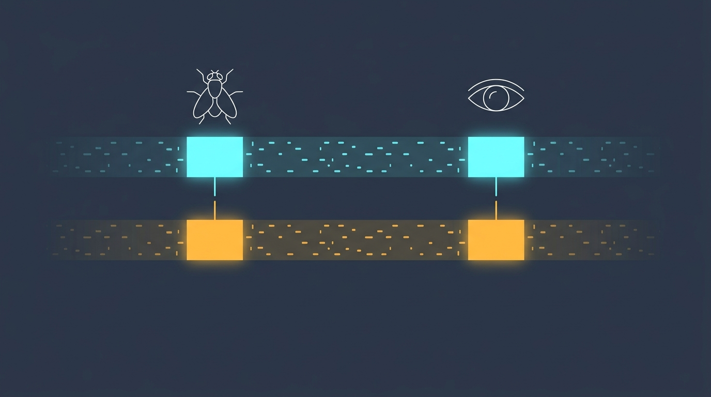
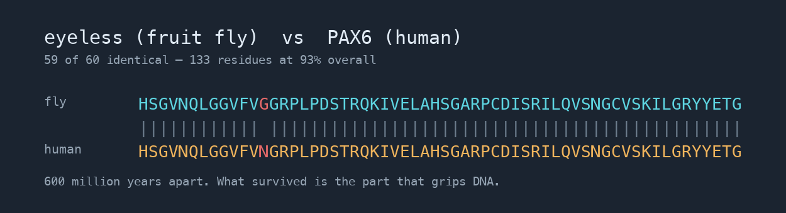

# The fly's eye experiment



```bash
python discover.py
```

A fly gene called `eyeless` and a human disease called `aniridia`. The names
share **nothing**. The sequences share **133 residues at 93% identity**:



```
    fly    HSGVNQLGGVFVGGRPLPDSTRQKIVELAHSGARPCDISRILQVSNGCVSKILGRYYETG
           |||||||||||| |||||||||||||||||||||||||||||||||||||||||||||||
    human  HSGVNQLGGVFVNGRPLPDSTRQKIVELAHSGARPCDISRILQVSNGCVSKILGRYYETG
```

*(rendered by `tools/render_alignment.py` from the vendored sequences — every
character comes from the data)*

One difference in sixty positions, between two lineages separated by roughly
600 million years.

This is the exercise that opens *Developing Bioinformatics Computer Skills*
(Gibas & Jambeck, O'Reilly 2001), the book that taught a generation of
biologists to turn a question into a computational experiment.

## What it finds

```
       eyeless           PAX6   length  identity   what it is
    57-189         5-137       133       93%   paired domain — grips regulatory DNA
   402-547       182-327       146       60%   contains the homeodomain
   598-629       371-402        32       19%*  no annotated domain here

  * indistinguishable from chance
```

The revealing part is not *that* they match: it is **where**. What survives
intact is precisely the piece that touches DNA, because changing it breaks the
protein. Everything in between has drifted freely — nothing was watching it.

### A block is not a domain, and the difference is 30 points

That second row says 60%, and a biologist should immediately distrust it: the
homeodomain is one of the most conserved DNA-binding motifs known.

The number is an artefact of what `conserved_blocks` returns. BLAST reports
**HSPs** — separate local alignments, each with its own E-value, which is why
the book gets two clean regions. This example takes **one** Smith–Waterman
alignment and splits it at its gaps, so the block containing the homeodomain
also carries its flanks:

| PAX6 region | aligned | identity |
|---|---|---|
| paired domain 4–136 | 132 | **94%** |
| **homeodomain 208–267** | 60 | **90%** |
| flank before it, 182–207 | 26 | 46% |
| flank after it, 268–327 | 60 | 35% |

**The homeodomain is 90% over 60 residues** — which is what the book's own
numbers say too (80 aa at 85%), not 60%. So `discover.py` now reports the blocks
the alignment found *and*, separately, the identity inside each annotated
domain. The discovery still leans on nothing but the alignment; the annotation
only ever labels it afterwards.

### The third row is not a linker. It is noise

19% identity across 32 residues used to be presented as "linker, far freer to
mutate" — a functional reading it never earned. Align eyeless against **shuffled**
PAX6 and the aligner still produces blocks: 40 shuffles give 74 of them,
averaging 25.6% identity and reaching 45%.

```
  real block len=133 id=93.2%  ->  0/74 shuffled blocks match it   signal
  real block len=146 id=59.6%  ->  0/74 shuffled blocks match it   signal
  real block len= 32 id=18.8%  -> 68/74 shuffled blocks match it   NOISE
```

It is *worse than average noise*. Nothing survived in that region at all — the
aligner kept extending because the score stayed positive, which is what local
aligners do. The honest version of the lesson is stronger than the old one:
where evolution was not watching, the result is indistinguishable from a
shuffle.

## Could it be chance? Don't assert it — measure it

Shuffle PAX6: same amino acids, same frequencies, order destroyed. That is the
null hypothesis made concrete, and any two sequences of this composition will
align to *something*. A hundred shuffles show you what that something is.

```
    35 │██████████████ 6
    38 │████████████████████████████████ 14
    41 │██████████████████████████████████████████████ 20
    44 │██████████████████████████████████████████████ 20
    47 │█████████████████████████ 11
    50 │██████████████████████████████████ 15
    53 │██████████████ 6
    56 │█████████ 4
    59 │██ 1
    68 │███████ 3
       │
   952 │▓▓▓▓▓▓▓▓▓▓▓▓▓▓▓▓▓▓▓▓▓▓▓▓▓▓▓▓▓▓▓▓▓▓▓▓▓▓▓▓▓▓▓▓▓▓  <- the real alignment
```

**133 standard deviations out, 13.4x the best of 100 shuffles**, in 0.7 seconds.
This is the idea BLAST turns into E-values; done here by brute force, which is
slower and much easier to believe.

`significance.py` is honest about what that number does and does not license:
the z-score assumes a normal null, while real local-alignment scores follow an
extreme-value distribution with a fatter right tail (you can see it in the bin
at 68). At 133 sigma the distinction changes nothing; at 3 it would change
everything.

That licensed the proposal that `eyeless` and the aniridia gene descend from a
common ancestral gene: the same switch turns on a fly's eye and yours. It was
later confirmed experimentally — mouse PAX6, placed in a fly, induces eyes
(Halder, Callaerts & Gehring, 1995).

One simplification worth undoing: *Drosophila* has **two** Pax6 paralogues,
`eyeless` and `twin of eyeless` (`toy`), plus the more distant `eyegone`. `toy`
sits upstream of `ey` in the cascade. "The fly's Pax6 gene" is a convenience;
the duplication is part of the real story.

**And a warning the book stresses:** sequence similarity produces a hypothesis,
not a proof. Confirming it takes real experiments.

## Why this is within anyone's reach

This was front-page science in 1995. Today: two public sequences, thirty lines
of Python, a few seconds on a laptop. No network, no BLAST binary, no account —
the sequences are vendored in `sequences.py`.

**The barrier is no longer the data or the compute. It is knowing what to ask.**

Which is exactly where an autonomous crew can help, and where it cannot: it can
write and repair the analysis code for you. The question is yours.

## The book's numbers do NOT reproduce, and that teaches something

The book reported the paired domain at eyeless 24–169 against a **447 aa** human
PAX6 from PIR (`A41644`), 128/146 identical, E = 5×10⁻⁶⁷. Here it comes out at
eyeless 57–189 against PAX6 5–137, 133 residues at 93%.

What the book actually reports, for the two regions BLAST returned:

| | query | subject | identities | positives | gaps | score | E |
|---|---|---|---|---|---|---|---|
| region 1 | 24–169 | 17–161 | 128/146 (87%) | 134/146 (91%) | 1/146 | 256 bits | 5e-67 |
| region 2 | 398–477 | 222–301 | 68/80 (85%) | 74/80 (92%) | — | 142 bits | 1e-32 |

**Two things changed, and only one of them is the database.**

1. **The entries moved.** The human protein is `P26367` in UniProt today, **422
   aa**, against the 447 aa PIR entry. The fly coordinates moved too — 24 → 57
   at one end and 398 → 402 at the other, which is not a constant offset, so the
   sequences differ by internal indels and not merely by a longer N-terminus.
   **The book does not name the eyeless entry it used**: its figure shows the
   alignment with an unlabelled `Query`. So there is nothing to look up, and
   nothing here is going to invent one.
2. **The method changed.** The book ran BLAST, which reports **HSPs** — separate
   local alignments, each with its own E-value. This runs a full Smith–Waterman
   with BLOSUM62 and −11/−1 gaps, and reports the ungapped blocks of a *single*
   alignment. The book does not state its matrix or whether low-complexity
   filtering was on, so those are not claimed here either.

**And the book's region 2 is the evidence for the correction above.** It is
**80 residues at 85%**, bracketing the homeodomain with a few residues either
side. Our block over the same biology is 146 residues at 60%, because one
Smith–Waterman alignment runs straight through the domain and its flanks and
averages them. The domain measured on its own is 90%. The book, the annotation
and `identity_over()` agree; only the raw block disagrees, and it is the raw
block that was wrong to label.

The biology is unchanged in both cases. That is why the sequences are
**vendored** rather than downloaded: an example that depends on a live database
stops meaning the same thing without telling you. It is also why the method is
spelled out rather than described as "an alignment" — chapter 2's insistence on
recording parameters, versions and inputs is the same point, and "the databases
moved" would have been half an answer.

## Two exercises for the crew

See [`exercise.md`](exercise.md). They are deliberately different shapes:

1. **Repair.** `python exercise.py break` reintroduces the off-by-one, and
   `harvest` finds it, writes its own goal and fixes it — the failing test is
   the oracle, so you write nothing at all.
2. **Build.** Delete `significance.py` and make the crew write it, with an
   acceptance criterion **you** wrote (`--accept`) that exercises the biology
   rather than checking a name exists.

## Files

```
discover.py     the runnable narration — start here
conserved.py    the analysis: local alignment and conserved blocks
significance.py is the alignment better than chance? measured, not asserted
sequences.py    PAX6_HUMAN and EYELESS_DROME, vendored from UniProt
tests/          the oracles: the paired domain, and the null that must say no
exercise.py     break / restore, to hand the repo to the crew in one command
exercise.md     both exercises, with what the local 12B actually did
```

Requires `biopython`.
